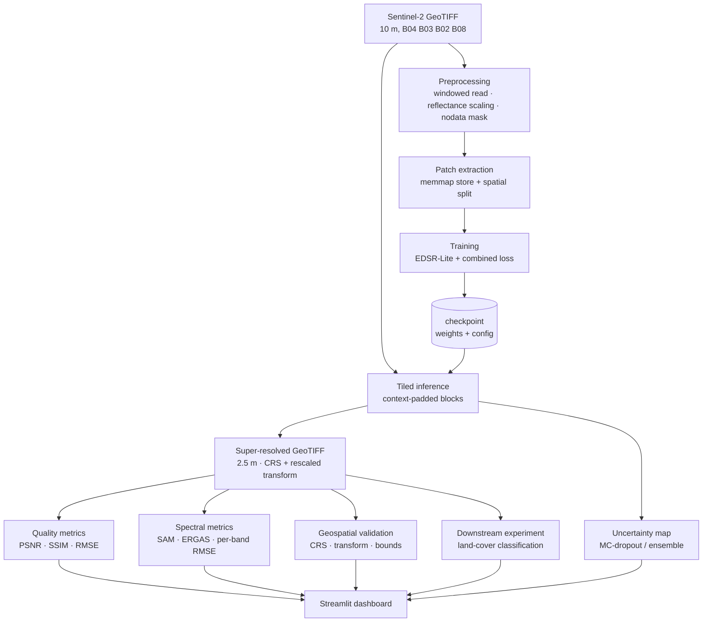
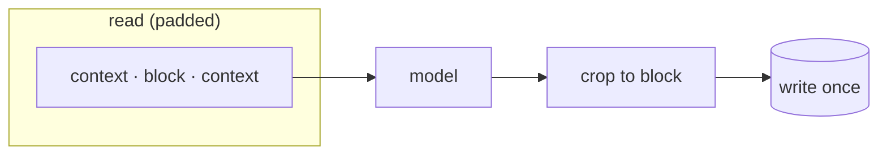
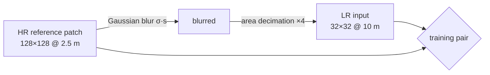

# SIH 2026 · PS-142 — Satellite Image Super-Resolution Platform

**Deep Learning Based Super Resolution Mapping (SRM) from Medium Resolution Satellite Imageries**

Takes a 10 m Sentinel-2 GeoTIFF and produces a **2.5 m** super-resolved GeoTIFF, together with
an uncertainty map, spectral-consistency metrics, geospatial validation, and a downstream
land-cover experiment that tests whether the super-resolution actually helps.

> ⚠️ **Super-resolved imagery contains AI-inferred information and should not be interpreted as
> direct high-resolution observation without validation.**

---

## Table of contents

1. [Problem statement](#1-problem-statement)
2. [Why ordinary image upscaling is insufficient](#2-why-ordinary-image-upscaling-is-insufficient)
3. [System architecture](#3-system-architecture)
4. [Dataset format](#4-dataset-format)
5. [Installation](#5-installation)
6. [Training](#6-training)
7. [Evaluation](#7-evaluation)
8. [Inference](#8-inference)
9. [Dashboard](#9-dashboard)
10. [Metrics](#10-metrics)
11. [Uncertainty](#11-uncertainty)
12. [Limitations](#12-limitations)
13. [Future improvements](#13-future-improvements)

**See also**

| Document | For |
|---|---|
| [`context.md`](context.md) | Project thesis, scientific constraints, roadmap |
| [`docs/PITCH.md`](docs/PITCH.md) | Slide-by-slide presentation script + anticipated judge questions |
| [`docs/DEMO.md`](docs/DEMO.md) | Live demo runbook — exact commands, timings, fallbacks |
| [`docs/real-data.md`](docs/real-data.md) | **Adding real Sentinel-2 data** — the highest-value next step |
| [`docs/gpu-runbook.md`](docs/gpu-runbook.md) | Running on the NVIDIA DGX B200 |

---

## 1. Problem statement

Sentinel-2 gives free, frequent, global coverage — but its finest bands are 10 m. A great many
operational questions in urban mapping, agriculture and disaster assessment need finer detail
than that, and commercial sub-metre imagery is expensive and infrequent.

This project reconstructs finer spatial detail from the 10 m observation using a learned model,
while holding onto the five properties that make the result *scientifically usable* rather than
merely attractive:

| Requirement | How it is addressed |
|---|---|
| Spatial / geographic consistency | Affine transform is **derived**, never copied; footprint is preserved exactly and verified by automated tests ([§3](#3-system-architecture)) |
| Spectral consistency | Spectral loss term during training; SAM / ERGAS / per-band RMSE at evaluation ([§10](#10-metrics)) |
| Useful fine-scale information | Structural and gradient loss terms; measured by the downstream land-cover experiment ([§7](#7-evaluation)) |
| Scientific reliability | Wald's protocol for quantitative metrics; every report states which protocol produced it |
| Explicit uncertainty | Per-pixel uncertainty map, presented as a *relative indicator*, never as a calibrated probability ([§11](#11-uncertainty)) |

---

## 2. Why ordinary image upscaling is insufficient

Running a photo super-resolution model on satellite imagery fails in four specific ways.

**A satellite pixel is a physical measurement, not a colour.** Each band value is surface
reflectance. Photo SR networks routinely use batch normalisation, per-image contrast
normalisation, and perceptual losses trained on RGB photographs — all of which rescale
radiometry. The moment absolute reflectance shifts, the product stops being remote-sensing data.
This codebase uses **no batch normalisation** and a **fixed physical scale factor** rather than
per-scene normalisation.

**Band ratios matter more than pixel values.** NDVI, NDWI and essentially every land-cover
classifier depend on *ratios between bands*, not absolute levels. A model can lower its pixel
loss by trading error between bands — improving PSNR while destroying NDVI. That is why a
[spectral loss term](#5-loss-function) is part of the objective and why
[SAM and ERGAS](#10-metrics) are reported alongside PSNR.

**Georeferencing is not optional.** A 4× super-resolved raster covers the same ground with 16×
the pixels, so the affine transform must have its pixel size divided by 4 while the origin stays
put. Copying the source transform — the most common bug in SR pipelines — produces a file that
opens fine and is silently 4× too large on the ground. This is checked by
`validate_geospatial()` and enforced in the test suite.

**Invented detail must be labelled.** A super-resolution model reconstructs plausible detail; it
does not observe it. Presenting that as measurement is the central scientific hazard here, which
is why uncertainty estimation and the observed/reconstructed/uncertain distinction are built into
the dashboard rather than bolted on.

**The honest framing used throughout:** the output is *AI-generated super-resolved imagery
containing reconstructed fine-scale information* — not "real 4 m satellite data".

---

## 3. System architecture



### Repository layout

```
sih142-satellite-sr/
├── context.md                   project thesis, constraints, roadmap
├── configs/
│   ├── config.yaml              single source of truth for every stage
│   └── profiles/                hardware overlays (cpu, dgx_b200)
├── docs/
│   ├── PITCH.md                 presentation script + judge Q&A
│   ├── DEMO.md                  live demo runbook
│   ├── real-data.md             importing real Sentinel-2 L2A
│   └── gpu-runbook.md           running on the NVIDIA DGX B200
├── src/
│   ├── config.py                config loading + cross-field validation
│   ├── compute.py               device selection, precision, torch tuning
│   ├── data/
│   │   ├── geotiff.py           windowed I/O, transform arithmetic, validation
│   │   ├── preprocessing.py     normalisation, nodata, degradation, patching
│   │   ├── patch_dataset.py     memmap dataset, spatial split, dataloaders
│   │   └── synthetic.py         synthetic scenes for tests and offline demos
│   ├── models/
│   │   ├── __init__.py          architecture registry (the extension point)
│   │   ├── baseline.py          bicubic / bilinear control
│   │   ├── generator.py         EDSR-Lite CNN
│   │   └── losses.py            pixel + structural + spectral + gradient
│   ├── training/train.py        loop, AMP, scheduling, checkpointing
│   ├── inference/predict.py     tiled inference, GeoTIFF writing
│   ├── evaluation/
│   │   ├── metrics.py           PSNR, SSIM, RMSE, SAM, ERGAS
│   │   └── evaluate.py          protocols + comparison reports
│   ├── uncertainty/uncertainty.py
│   └── applications/urban_mapping.py
├── scripts/                     CLI entry points (incl. import_sentinel2.py)
├── app/dashboard.py             Streamlit UI
└── tests/                       337 tests incl. an end-to-end smoke test
```

### Three design decisions worth knowing

**Global residual over bicubic.** The network predicts only the high-frequency *residual* added
to a bicubic upsample, and its output layer is zero-initialised. Consequences: at step 0 the
model is exactly the bicubic baseline (so training can only improve on it), low-frequency
content — which carries the spectral signature — passes through untouched, and convergence is
much faster because the identity mapping never has to be learned.

**Sub-pixel upsampling at the end.** All convolutions run at *low* resolution and the channel
axis is folded into space once, at the end, via `PixelShuffle`. For scale 4 that is ~16× less
convolution work than upsampling first, and it avoids the checkerboard artefacts of transposed
convolutions — artefacts that in an SR product would be indistinguishable from real fine
structure.

**Context-padded, non-overlapping writes.** A full Sentinel-2 tile at 4× is ~30 TB as float32,
so neither the output nor a blending accumulator can live in memory. Each output block is written
exactly once from a prediction that saw `tile_overlap` pixels of real context on every side.
No accumulator, no blending, no seams — verified by `test_tiled_inference_matches_a_single_pass`.



---

## 4. Dataset format

**Input.** A GeoTIFF with the bands ordered as declared in `configs/config.yaml`:

```yaml
data:
  bands:        [B04, B03, B02, B08]   # Red, Green, Blue, NIR
  band_indices: [1, 2, 3, 4]           # 1-indexed positions in the file
  dn_scale:     10000.0                # Sentinel-2 L2A: reflectance = DN / 10000
```

Requirements: a valid CRS and affine transform, and — for training references — a pixel size of
`target_resolution_m`. `uint16` DN is expected by default; `float32` reflectance works if you set
`dn_scale: 1.0`. Adding more bands means extending those two lists; nothing else changes, because
`model.in_channels` is validated against `len(data.bands)` at load time.

**Directories.**

| Path | Contents |
|---|---|
| `data/raw/` | input scenes (also where `--synthetic` writes demo data) |
| `data/reference/` | optional co-registered high-resolution references |
| `data/patches/` | `patches.npy` (memmapped HR patches) + `manifest.json` |
| `checkpoints/` | `best.pth`, `last.pth`, `history.csv` |
| `outputs/` | evaluation reports, inference products, dashboard exports |

**How training pairs are made.** Only the HR reference is stored. The LR input is synthesised
on load by blurring (approximating the sensor MTF) and then decimating:



Blur-then-decimate mirrors how a coarser sensor actually forms a pixel. Decimating *without*
blurring aliases high frequencies into the LR image and teaches the network to undo an artefact
real Sentinel-2 data does not contain.

**Validation.** `check_pair_alignment()` reports CRS mismatch, dimension mismatch, resolution
mismatch and sub-pixel origin offset. It returns warnings rather than raising, because
user-supplied pairs are frequently not co-registered and the caller should decide whether to skip
or abort.

**Splitting.** Patches are split **spatially**, in blocks of 4×4 patches, using a BLAKE2b hash of
`(seed, scene, block_row, block_col)`. With a stride smaller than the patch size, neighbouring
patches overlap; a random split would place overlapping pixels in both train and validation and
inflate the validation metric.

---

## 5. Installation

Requires **Python 3.12** (PyTorch has no 3.14 wheels yet).

```bash
git clone <repo> && cd sih142-satellite-sr
python3.12 -m venv .venv
source .venv/bin/activate          # Windows: .venv\Scripts\activate
pip install -r requirements.txt
pytest -q                          # 337 tests, ~25 s on CPU
```

CUDA is used automatically when available. For a GPU build matched to your driver:

```bash
pip install torch --index-url https://download.pytorch.org/whl/cu124
```

<details>
<summary><b>Windows: Smart App Control blocks PyTorch, rasterio and matplotlib</b></summary>

Windows 11 Smart App Control blocks unsigned native `.pyd` extensions, so `import torch` fails
with `ImportError: DLL load failed … An Application Control policy has blocked this file`. Check
with:

```powershell
(Get-ItemProperty 'HKLM:\SYSTEM\CurrentControlSet\Control\CI\Policy').VerifiedAndReputablePolicyState
# 1 = on, 0 = off
```

Recommended fix is WSL2, which Smart App Control does not apply to and which is not irreversible
(turning Smart App Control off requires a clean Windows reinstall to re-enable):

```powershell
wsl --install -d Ubuntu
```

then inside WSL:

```bash
sudo bash scripts/setup_wsl.sh     # installs uv + Python 3.12 + the full stack
/opt/sih-venv/bin/python -m pytest -q
```
</details>

---

## 6. Training

```bash
python scripts/prepare_dataset.py              # data/raw/*.tif
python scripts/prepare_dataset.py --synthetic  # no data? generate demo scenes
python scripts/train.py
```

Useful overrides: `--epochs`, `--batch-size`, `--lr`, `--workers`, `--device`, `--no-amp`,
`--model bicubic` (to sanity-check the plumbing without training).

### CPU first, by default

`configs/config.yaml` ships with `compute.device: cpu`, and the batch size, epoch
count and worker count are sized for a laptop. This is deliberate — a fresh clone
behaves identically on every machine, and nobody discovers halfway through a run
that they were silently on a GPU whose driver is too old to actually work.

Opting into an accelerator is an explicit act. Device precedence is
**`--device` → `compute.device` → `auto`**.

### Hardware profiles

A profile is a small YAML *overlay* merged on top of the base config:

```bash
python scripts/train.py --profile cpu        # force CPU even where a GPU exists
python scripts/train.py --profile dgx_b200   # NVIDIA DGX B200
```

`configs/profiles/dgx_b200.yaml` holds only what differs — device, precision,
batch size, worker count, patch geometry — and inherits the rest, so the two can
never drift apart the way two full copies of the config would. All four scripts
accept `--profile`.

A profile may only touch *hardware* keys. A test asserts that no profile
overrides `data`, `loss` or `evaluation`, because **changing where a run executes
must never silently change what is being measured.**

Full instructions for the college cluster, including the Blackwell `sm_100`
PyTorch trap, are in [`docs/gpu-runbook.md`](docs/gpu-runbook.md).

### The loss, and why each term is there

```
Total = w_pixel·L1  +  w_struct·(1 − SSIM)  +  w_spectral·(1 − cos θ)  +  w_grad·|∇pred − ∇ref|
         1.0                0.15                     0.30                        0.05
```

| Term | Purpose | Why not something else |
|---|---|---|
| **Pixel (L1)** | Radiometric fidelity — land on the right reflectance value | L2 is minimised by the conditional *mean* of plausible textures, which produces blur |
| **Structural (1 − SSIM)** | Reward recovering edges and texture, not just the right average | Pixel losses are indifferent to whether an edge is sharp |
| **Spectral (1 − cos θ)** | Preserve per-pixel band ratios, and therefore NDVI/NDWI and any downstream classifier | This is the term that makes it *satellite* SR rather than upscaling |
| **Gradient** | Directly penalise over-smoothing | An adversarial term would sharpen more, at the cost of hallucination |

**Why `1 − cos θ` and not SAM itself.** They share the same minimum and the same ordering, but
`arccos` has an unbounded derivative as the angle approaches zero — exactly where a well-trained
model operates — which destabilises training. True SAM in degrees is reported as a *metric*
(`src/evaluation/metrics.py`), where numerical stability of the gradient is irrelevant.

All four weights live in `configs/config.yaml`; a term with weight 0 is skipped entirely rather
than multiplied by zero, so disabling it also removes its compute cost.

### Performance notes

Mixed precision (CUDA only, ~2× throughput), `channels_last` memory format for tensor cores,
cuDNN autotuning (every training tile has identical shape, so the search amortises immediately),
cosine LR annealing, and `zero_grad(set_to_none=True)`. Validation metrics are computed in torch
on-device rather than round-tripping through NumPy.

`compute.amp_dtype: auto` prefers **bf16** wherever the hardware supports it. bf16 carries fp32's
exponent range, so it needs no loss scaling and cannot silently overflow — worth more here than
fp16's extra mantissa bit, given reflectance already lives in `[0, 1]`. The GradScaler is engaged
only for fp16.

Autocast stays CUDA-only. CPU autocast is bf16-only and, without AVX512-BF16, is usually *slower*
than plain fp32 — enabling it by default would be a pessimisation dressed up as an optimisation.

---

## 7. Evaluation

```bash
python scripts/evaluate.py                                     # reduced-resolution protocol
python scripts/evaluate.py --input scene.tif --reference hr.tif  # against a real reference
python scripts/evaluate.py --downstream                        # + land-cover experiment
```

### The reference problem, and the three protocols

Quantitative SR metrics need ground truth at the target resolution — which, for 10 m → 2.5 m,
usually does not exist. Every report states which protocol produced its numbers.

| Protocol | When | What you get |
|---|---|---|
| **`reduced_resolution`** (default) | always available | Fully quantitative. Wald's protocol: degrade 10 m → 40 m, super-resolve back to 10 m, score against the real 10 m observation. Assumes model behaviour transfers across the scale step — an assumption, not a proof. |
| **`full_resolution`** | a co-registered HR reference exists | Direct comparison, with an alignment check first — a misregistered reference produces confidently wrong numbers. |
| **`reference_free`** | nothing else available | Consistency indicators only. Explicitly marked as **not** measuring reconstruction accuracy. |

### Downstream experiment (does SR actually help?)

PSNR going up does not mean the product is more useful. The land-cover experiment classifies
the bicubic baseline and the AI-SR output and compares the resulting maps.

The classifier is fitted **once on the reference image** and its centroids are then applied
unchanged to every product, so class *k* means the same thing everywhere and accuracy is directly
meaningful. It is a deliberately simple minimum-distance classifier: a high-capacity model could
compensate for a poor reconstruction with its own learned priors and confound the measurement.
NDVI and NDWI are included as features precisely because they are ratio-based — the quantities a
spectrally inconsistent model would corrupt.

**Anti-fabrication guarantee.** With no reference available, the experiment returns
`quantitative: false`, reports only structural descriptors (map *detail*, explicitly not map
*accuracy*), and its verdict reads `NOT MEASURED`. Reference labels derived by clustering are
disclosed as such in the caveats.

---

## 8. Inference

```bash
python scripts/inference.py --input sample.tif
python scripts/inference.py --input scene.tif --stream          # full Sentinel-2 tiles
python scripts/inference.py --input scene.tif --baseline        # bicubic control
```

Produces, in `outputs/inference/`:

| File | Contents |
|---|---|
| `<stem>_sr.tif` | super-resolved GeoTIFF at 2.5 m, source CRS, rescaled transform, provenance tags |
| `<stem>_uncertainty.tif` | single-band float32 uncertainty map |
| `<stem>_inference.json` | geospatial validation, timings, uncertainty summary, disclaimer |

Every run prints a geospatial validation table and **exits non-zero if it fails**:

```
geospatial validation:
  [PASS] has_crs
  [PASS] crs_matches_source
  [PASS] dimensions_scaled
  [PASS] resolution_scaled
  [PASS] bounds_preserved
  [PASS] transform_not_identity
```

The output GeoTIFF also carries `SR_DISCLAIMER`, `SR_SCALE`, `SR_SOURCE` and `SR_MODEL` tags, so
the provenance travels with the file rather than living only in this README.

---

## 9. Dashboard

```bash
streamlit run app/dashboard.py
```

Five tabs: **Imagery** (observed / bicubic / AI-SR side by side, plus error and spectral-angle
maps, with a region selector for zooming), **Metrics** (PSNR · SSIM · RMSE · SAM · ERGAS with
deltas against the bicubic baseline, and per-band RMSE), **Uncertainty**, **Geospatial**
(CRS, dimensions, resolution, bounds, processing time), and **Export** (SR GeoTIFF, uncertainty
GeoTIFF, metrics JSON and CSV).

### Explainability

The dashboard's job is not to make the output look impressive — it is to let a reviewer judge how
much of what they see was *observed* and how much was *inferred*. The disclaimer renders above
any imagery, and every session shows:

| | |
|---|---|
| 🛰️ **Observed** | Information genuinely recorded by Sentinel-2 at 10 m. Every low-frequency structure traces back to a real measurement. |
| 🧠 **Reconstructed** | Detail below the sensor's resolving power, produced by the network from patterns learnt in training. Plausible, not measured — individual small features may not exist. |
| ❓ **Uncertain** | Where the model's own predictions disagree. Detail here is unreliable. |

Display contrast stretches are cosmetic and never touch the arrays used for metrics.

---

## 10. Metrics

Two families, answering different questions.

**Reconstruction quality** — *how close is the output to the reference?*

| Metric | Range | Meaning |
|---|---|---|
| PSNR | dB, ↑ | Peak signal-to-noise ratio. Computed per-sample then averaged, so one easy tile cannot mask a bad one. |
| SSIM | 0–1, ↑ | Local means, variances and covariance — rewards structure, not just averages. |
| RMSE | ↓ | Error in reflectance units. |

**Spectral consistency** — *does the output still represent the same physical surface?*

| Metric | Range | Meaning |
|---|---|---|
| **SAM** | degrees, ↓ | Mean angle between per-pixel band vectors. Invariant to brightness scaling, so it isolates *spectral* distortion from radiometric error. The primary spectral metric here. |
| **ERGAS** | ↓ | `(100/ratio)·√(mean_k (RMSE_k/μ_k)²)` (Wald, 2000). Per-band normalisation makes it dimensionless and comparable across bands with very different reflectance levels. Below ~3 is conventionally good. |
| **Per-band RMSE** | ↓ | Pooled RMSE hides a single bad band — typically NIR, which has the widest dynamic range and the fewest natural-image analogues in the model's inductive bias. |

Nodata pixels are excluded from every statistic, and `evaluation.border_crop` drops boundary
pixels. Metric deltas in reports are **sign-normalised**: a positive delta always means the method
improved on the baseline, whichever direction the raw metric runs.

---

## 11. Uncertainty

**What the map is:** a *relative indicator of model instability*, in reflectance units.

**What it is not:** a calibrated probability. There is no calibration data for the inferred
sub-pixel detail, because by definition it was never observed. Nothing in this codebase claims
otherwise; `summarise()` sets `"calibrated": false` explicitly and the GeoTIFF carries the caveat
as a tag.

**How to read it:** *"the model's answer here is not robust, so more of what you see is
reconstruction than observation."* **High uncertainty is a reliable warning. Low uncertainty is
not a guarantee of correctness** — a model can be confidently wrong, and none of these methods
detect that.

| Method | Measures | Notes |
|---|---|---|
| `ensemble` **(default)** | Sensitivity to an arbitrary framing choice, via the eight D4 symmetries | Works with any architecture, no special training; the mean is also a genuinely better prediction |
| `mc_dropout` | Epistemic uncertainty: disagreement among sub-networks the training found equally acceptable | Needs `model.dropout > 0`; falls back to `ensemble` automatically if the checkpoint has none |
| `reprojection` | Disagreement with the **observed** pixels after degrading the output back to input resolution | The only signal anchored to real measurements — but blind to invented detail that averages back correctly (see `test_reprojection_residual_penalises_a_hallucinating_product`) |

The reprojection residual is computed and reported *alongside* whichever method is selected,
because sampling-based and observation-based signals fail in different ways.

### Why the default is `ensemble`, not `mc_dropout`

Measured spread on the reference model:

| Method | mean | p95 | max |
|---|---|---|---|
| `mc_dropout` | 1.6 × 10⁻⁸ | 3.0 × 10⁻⁸ | 3.0 × 10⁻⁸ |
| `ensemble` | 7.0 × 10⁻⁴ | 1.7 × 10⁻³ | 4.5 × 10⁻³ |
| `reprojection` | 1.4 × 10⁻³ | 3.8 × 10⁻³ | 1.7 × 10⁻² |

MC-dropout collapses on this architecture because dropout sits inside residual blocks scaled by
`res_scale`, whose output is added to a bicubic base. The residual branch is small, so perturbing
it barely moves the output — the resulting "uncertainty" is numerically zero. It becomes useful
again once the model is trained long enough for that branch to carry real signal.

**This is exactly the failure mode the design has to guard against**: a near-zero map read
naively looks like *total confidence*, when it actually means *the method found nothing to
measure*. `estimate()` therefore detects a degenerate map and attaches an explicit note saying
so, rather than letting the zeros speak for themselves.

---

## 12. Limitations

**Scientific**

- Metrics come from **Wald's protocol** unless a real HR reference is supplied. Performance at the
  operational 10 m → 2.5 m step is *assumed* to transfer from the coarser step, not measured.
- The degradation model (Gaussian blur + area decimation) is an **approximation** of the Sentinel-2
  MTF. A model trained under it may underperform on real imagery whose PSF differs.
- Uncertainty maps are **not calibrated**. See [§11](#11-uncertainty).
- Reference land-cover labels in the downstream experiment are **cluster-derived**, not field-
  surveyed, unless you supply `application.labels_path`.
- **The shipped model is trained on synthetic scenes** unless you retrain on real Sentinel-2 data.
  Metrics from the synthetic demo measure the pipeline's plumbing, not its scientific performance.
  This is stated in `src/data/synthetic.py` and worth repeating.

**Technical**

- `--stream` mode skips uncertainty estimation (it needs the scene in memory).
- Scale factors must decompose into 2s and 3s for the PixelShuffle upsampler.
- Multi-scene training assumes a common CRS; scenes are not reprojected for you.
- Cloud and shadow masking is not implemented — only nodata masking. Cloudy patches are partly
  filtered by the `min_std` heuristic, which is not a substitute for a real cloud mask.
- Atmospheric correction is assumed to have happened upstream (L2A input).

---

## 13. Future improvements

**Model.** SwinIR or a Restormer-style Transformer, registered via `@register_model("swinir")` —
the pipeline needs no other change (see the extension point at the bottom of
`src/models/generator.py`). Then a diffusion model for a perceptual-quality variant, kept
*separate* from the fidelity model rather than replacing it, since the failure modes differ.

**Data.** Real paired training data — Sentinel-2 with co-registered PlanetScope (3 m) or
WorldView, which would replace synthetic degradation with a learned real-world degradation and
make full-resolution evaluation routine. Adding the 20 m bands with a multi-resolution encoder.

**Uncertainty.** Calibrate against held-out real HR references so the map can carry a defensible
probabilistic reading; or a heteroscedastic head predicting per-pixel variance directly.
Conformal prediction would give distribution-free coverage guarantees.

**Applications.** The `src/applications/` package is structured for extension — agriculture
(field-boundary delineation, crop-type mapping) and disaster assessment (building-damage
detection) are the obvious next two, reusing the same `run_experiment` comparison harness.

**Engineering.** ONNX/TensorRT export for deployment; distributed training for continental-scale
datasets; a COG (Cloud-Optimised GeoTIFF) writer with overviews for web-map serving.

---

## Acceptance criteria

```bash
python scripts/prepare_dataset.py --synthetic   # also writes ./sample.tif at 10 m
python scripts/train.py
python scripts/evaluate.py --downstream
python scripts/inference.py --input sample.tif
streamlit run app/dashboard.py
```

Yields a < 4 m super-resolved GeoTIFF, an uncertainty map, evaluation metrics against the bicubic
baseline, and a visual comparison in the dashboard.

> `--synthetic` writes the training references to `data/raw/` at 2.5 m **and** a matching 10 m
> observation to `./sample.tif`. Use `sample.tif` for inference and the dashboard — feeding a
> 2.5 m reference to `inference.py` would super-resolve an already-fine image.

### v1 reference run

Reproduced from the commands above (3 synthetic 1024² scenes → 363 patches, 309 train / 54 val,
EDSR-Lite with 1,223,300 parameters, 12 epochs, CPU, 17–20 s/epoch):

| | PSNR (dB) ↑ | SSIM ↑ | RMSE ↓ | SAM (°) ↓ | ERGAS ↓ |
|---|---|---|---|---|---|
| Bicubic baseline | 34.97 | 0.8447 | 0.0178 | 2.791 | 2.772 |
| **AI super-resolution** | **36.40** | **0.8707** | **0.0151** | **2.622** | **2.294** |
| Δ | **+1.43** | **+0.026** | **−0.0027** | **−0.169** | **−0.478** |

Downstream land-cover classification (same centroids applied to both products):

| | Overall accuracy | mIoU |
|---|---|---|
| Bicubic baseline | 0.9708 | 0.8954 |
| **AI super-resolution** | **0.9879** | **0.9527** |

> Expect **run-to-run variance of roughly ±0.3 dB** on a retrain. `set_seed` enables cuDNN
> autotuning and the dataloader augments in worker processes, so runs are reproducible in
> distribution rather than bitwise. Re-run `evaluate.py` after any retrain rather than quoting a
> figure from an earlier checkpoint — the bicubic column is deterministic and should not move.

> **These numbers come from synthetic scenes.** They demonstrate that the pipeline is wired
> correctly end to end — that the model beats its baseline on both image quality *and* a
> downstream task, without spectral degradation. They are **not** a measurement of scientific
> performance on real Sentinel-2 imagery. Retrain on real data before quoting any figure.

## Testing

```bash
pytest -q                        # 337 tests
pytest tests/test_end_to_end.py  # the full acceptance sequence on synthetic data
```

Coverage spans GeoTIFF loading, preprocessing, patch generation, tensor dimensions, model forward
passes, loss calculation, metric calculation, GeoTIFF output, CRS preservation, transform
arithmetic, the inference pipeline, and an end-to-end smoke test.
